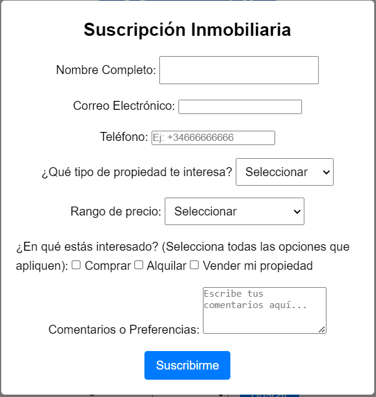
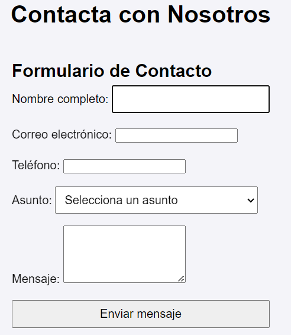

# Project's Folder and File Structure

Treball-Web-LLMM-main  
    .DS_Store  
    aboutus.html  
    casa1.html  
    casa10.html  
    casa2.html  
    casa3.html  
    casa4.html  
    casa5.html  
    casa6.html  
    casa7.html  
    casa8.html  
    casa9.html  
    contact.html  
    ibiza.html  
    index.html  
    mallorca.html  
    menorca.html  
    script.js  

images  
    .DS_Store  
    favicon.png  
    home.jpg  
    logo.png  

 casas  
      1  
        casa 1.url  
        casa1_1.png  
        casa1_2.png  
        casa1_3.png  
        casa1_4.png  
        casa1_5.png  
        casa1_6.png  
        casa1_7.png  
        casa1_8.png  
        
10  
            Casa10_1.png  
            Casa10_10.png  
            Casa10_2.png  
            Casa10_3.png  
            Casa10_4.png  
            Casa10_5.png  
            Casa10_6.png  
            Casa10_7.png  
            Casa10_8.png  
            Casa10_9.png  
            LINK CASA.docx  

2  
            casa 2.url  
            casa2_1.png  
            casa2_2.png  
            casa2_3.png  
            casa2_4.png  
            casa2_5.png  
            casa2_6.png  
            casa2_7.png  
            casa2_8.png  

  3  
            casa 3.url  
            casa3_1.png  
            casa3_2.png  
            casa3_3.png  
            casa3_4.png  
            casa3_5.png  
            casa3_6.png  
            casa3_7.png  

  4  
            casa 4.url  
            casa4_1.jpg  
            casa4_10.jpg  
            casa4_11.jpg  
            casa4_12.jpg  
            casa4_2.jpg  
            casa4_3.jpg  
            casa4_4.jpg  
            casa4_5.jpg  
            casa4_6.jpg  
            casa4_7.jpg  

styles  
    .DS_Store  
    style.css  
    stylecasas.css  


# Inmobiliaria Mar Mediterráneo

## Descripción del Proyecto
Este proyecto es un sitio web para una inmobiliaria ficticia llamada "Inmobiliaria Mar Mediterráneo". El sitio web permite a los usuarios buscar propiedades en diferentes islas y ver detalles específicos de cada propiedad.

## Tecnologías Utilizadas

### **HTML**
- Utilizado para estructurar el contenido del sitio web.
- Archivos principales: `index.html`, `mallorca.html`, `menorca.html`, `ibiza.html`, `casa1.html` a `casa10.html`.

### **CSS**
- Utilizado para estilizar el contenido del sitio web y hacerlo visualmente atractivo.
- Archivos principales: `styles/style.css`, `styles/stylecasas.css`.
- Incluye estilos responsivos para asegurar una buena visualización en dispositivos móviles.

### **JavaScript**
- Utilizado para añadir interactividad al sitio web.
- Archivo principal: `script.js`.
- Funcionalidades: 
  - Menú hamburguesa
  - Slider de imágenes
  - Validación de formularios
  - Efectos hover en iconos de redes sociales (cambio de color blanco a dorado)
  - Sistema de mensajes y comentarios con funcionalidad de mostrar/ocultar
- Archivos casas : `casax.html`.
   - Ampliar imagen al clicar sobre ella
   - Boton de mostrar, ocultar precio
   - Botones de carrusel de imagenes

### **Font Awesome**
- Utilizado para añadir iconos de redes sociales y otros iconos gráficos.
- Enlace CDN: `https://cdnjs.cloudflare.com/ajax/libs/font-awesome/6.0.0-beta3/css/all.min.css`.

### **Imágenes**
- Utilizadas para mostrar las propiedades y mejorar la experiencia visual del usuario.
- Directorio principal: `images/`.

## Características del Proyecto

1. **Navegación Intuitiva**:
   - Menú de navegación claro y accesible.
   - Menú hamburguesa para dispositivos móviles.

2. **Slider de Imágenes**:
   - Slider de imágenes para mostrar diferentes vistas de las propiedades.
   - Botones de navegación para moverse entre las imágenes.

3. **Páginas de Propiedades**:
   - Páginas individuales para cada propiedad con detalles específicos.
   - Información de contacto para facilitar la comunicación con la inmobiliaria.

4. **Formulario de Búsqueda**:
   - Formulario para seleccionar y buscar propiedades en diferentes islas.
   - Validación del formulario para asegurar que se seleccione una opción antes de enviar.

5. **Diseño Adaptable**:
   - Estilos CSS responsivos para asegurar una buena visualización en dispositivos móviles y de escritorio.

6. **Elementos Interactivos**:
   - Archivo `script.js` para añadir funcionalidades dinámicas como:
     - Sliders de imágenes
     - Validación de formularios
     - Efectos hover en iconos sociales del footer
     - Menú hamburguesa responsive
     - Sistema de comentarios con botones para mostrar/ocultar
     - Envío de mensajes rápidos con nombre y contenido

7. **Branding**:
   - Incluye un logo (`images/logo.png`) y favicon (`images/favicon.png`) para una marca visual consistente.

## Características Principales y Funcionalidades del Sitio Web

1. **Listados de Propiedades**:
   - Páginas dedicadas para propiedades individuales (por ejemplo, `casa1.html` a `casa10.html`).
   - Incluye imágenes, descripciones y potencialmente precios u otros detalles para cada propiedad.

2. **Enfoque Regional**:
   - Páginas como `mallorca.html`, `menorca.html` e `ibiza.html` proporcionan un enfoque en diferentes regiones, facilitando a los usuarios encontrar propiedades en ubicaciones específicas.

3. **Navegación Interactiva**:
   - Una página de inicio (`index.html`) sirve como el centro principal para navegar a través de los listados de propiedades y las páginas regionales.

4. **Página de Contacto**:
   - Una página dedicada `contact.html` para consultas, probablemente con un formulario para que los usuarios se pongan en contacto respecto a las propiedades.

5. **Galerías de Imágenes**:
   - Carpetas específicas de propiedades con múltiples imágenes (`casaX_Y.png` o `.jpg`) sugieren galerías detalladas para visualizar las propiedades.

## Modificaciones realizadas en los archivos HTML, CSS

### formcheckbox.html
- El formulario incluye campos para nombre, correo electrónico, teléfono, tipo de propiedad, rango de precio, intereses (comprar, alquilar, vender) y un área de texto para comentarios. Los botones y campos están estilizados para ser amigables y accesibles. El botón de envío está etiquetado como "Suscribirme".

### index.html

#### Estilos para el popup (lineas 11-51)

Este bloque de código CSS define los estilos para un popup en una página web. 

1. **Clase .popup:**
- Posiciona el popup de manera fija en toda la pantalla (position: fixed).
- Ocupa el 100% del ancho y alto de la pantalla.
- Aplica un fondo semitransparente negro (background-color: rgba(0, 0, 0, 0.5)).
- Centra el contenido del popup tanto horizontal como verticalmente (display: flex, justify-content: center, align-items: center).
- Inicialmente, el popup es invisible (visibility: hidden, opacity: 0).
- Añade una transición suave para la visibilidad y opacidad (transition: visibility 0s, opacity 0.5s).
- Asegura que el popup esté por encima de otros elementos (z-index: 1000).

2. **Clase .popup.active:**
- Hace visible el popup (visibility: visible, opacity: 1).

3. **Clase .popup-content:**
- Establece el fondo blanco para el contenido del popup.
- Añade padding, bordes redondeados y sombra para darle estilo.
- Limita el ancho máximo a 500px y ajusta el ancho al 100% del contenedor.

4. **Estilos para button:**
- Define el estilo de los botones dentro del popup.
- Aplica un color de fondo azul y texto blanco.
- Añade padding, bordes redondeados y un cursor de puntero.
- Cambia el color de fondo al pasar el cursor sobre el botón (:hover).
  
Estos estilos aseguran que el popup sea visualmente atractivo y funcional, apareciendo y desapareciendo suavemente cuando se activa o desactiva.

#### Formulario Popup (lineas 89-161)

Este código HTML define un formulario de suscripción inmobiliaria dentro de un popup.

1. **Contenedor del Popup:**
- <div class="popup" id="popup"> contiene el formulario y lo centra en la pantalla.
  
2. **Contenido del Popup:**
- <div class="popup-content"> estiliza el contenido del popup.

3. **Formulario:**
- <form id="subscriptionForm" action="tu-script-o-endpoint" method="POST"> define el formulario con el método POST.

4. **Campos del Formulario:**
- Nombre Completo: <input type="text" id="nombre" name="nombre" required>
- Correo Electrónico: <input type="email" id="email" name="email" required>
- Teléfono: <input type="tel" id="telefono" name="telefono" placeholder="Ej: +34666666666">
- Tipo de Propiedad: <select id="tipo" name="tipo" required> con opciones para casa, apartamento, oficina y terreno.
- Rango de Precio: <select id="precio" name="precio"> con varias opciones de rango de precios.
- Intereses: Checkboxes para comprar, alquilar o vender propiedad.
- Comentarios: <textarea id="mensaje" name="mensaje" rows="4" placeholder="Escribe tus comentarios aquí..."></textarea>
- Botón de Envío: <button type="submit">Suscribirme</button> para enviar el formulario.

El formulario está diseñado para ser claro y fácil de usar, capturando toda la información necesaria para la suscripción inmobiliaria.

#### Script para el popup (lineas 173-185)

El código JavaScript proporcionado gestiona la visualización y el comportamiento de envío de un formulario en un popup.

1. **Mostrar el popup al cargar la página:**
- La función window.onload se ejecuta cuando toda la página ha terminado de cargarse.
- Dentro de esta función, se selecciona el elemento con el ID popup (document.getElementById('popup')) y se le añade la clase active (classList.add('active')).
- Esto hace que el popup sea visible al aplicar los estilos CSS definidos para la clase .popup.active.

2. **Cerrar el popup al enviar el formulario:**
- Se añade un evento onsubmit al formulario con el ID subscriptionForm (document.getElementById('subscriptionForm').onsubmit).
- Cuando el formulario se envía, se ejecuta una función que previene el comportamiento predeterminado del formulario (event.preventDefault()).
- Esto permite ejecutar lógica personalizada antes de que el formulario se envíe realmente.
- Dentro de esta función, se selecciona el elemento con el ID popup y se le quita la clase active (classList.remove('active')), lo que oculta el popup.
- El comentario // Aquí puedes añadir la lógica para enviar el formulario indica dónde se puede añadir código adicional para manejar el envío del formulario, como enviar los datos del formulario a un servidor.

En resumen, este script asegura que el popup se muestre cuando la página se carga y se oculte cuando el formulario se envía, permitiendo además la inclusión de lógica personalizada para el manejo del envío del formulario.

### style.css (lineas 191-)

El código CSS define los estilos para un popup:

1. **Clase .popup:**
- Posiciona el popup de manera fija en toda la pantalla (position: fixed).
- Ocupa el 100% del ancho y alto de la pantalla.
- Fondo semitransparente negro (background-color: rgba(0, 0, 0, 0.5)).
- Usa flexbox para centrar el contenido (display: flex; justify-content: center; align-items: center).
- Inicialmente oculto (visibility: hidden; opacity: 0).
- Transición suave para visibilidad y opacidad (transition: visibility 0s, opacity 0.5s).

2. **Clase .popup.active:**
- Hace visible el popup (visibility: visible; opacity: 1).

3. **Clase .popup-content:**
- Fondo blanco (background: #ffffff).
- Padding de 20px.
- Bordes redondeados (border-radius: 5px).
- Sombra sutil (box-shadow: 0 4px 8px rgba(0, 0, 0, 0.1)).
- Ancho máximo de 500px (max-width: 500px) y ocupa el 100% del contenedor (width: 100%).

## Formularios



**Campos del formulario de suscripción**

- Nombre Completo
- Correo Electrónico
- Teléfono
- Tipo de Propiedad
- Rango de Precio
- Intereses
- Comentarios
- Botón de Envío



**Campos del formulario de contacto**

- Nombre Completo
- Correo Electrónico
- Teléfono
- Asunto
- Mensaje
- Botón de Envío

## Expresiones regulares para la validación

1. **Correo Electrónico**:
   ```regex
   [a-z0-9._%+-]+@[a-z0-9.-]+\.[a-z]{2,}$

- Descripción: Esta expresión regular valida que el campo de correo electrónico tenga un formato correcto.
- Componentes:
  - [a-z0-9._%+-]+: Uno o más caracteres que pueden ser letras minúsculas, números, puntos, guiones bajos, porcentajes, signos más o guiones.
  - @: Un símbolo arroba obligatorio.
  - [a-z0-9.-]+: Uno o más caracteres que pueden ser letras minúsculas, números, puntos o guiones.
  - \.: Un punto literal.
  - [a-z]{2,}$: Dos o más letras minúsculas al final de la cadena.

2. **Teléfono:**
   ```regex
   \+[0-9]{1,3}\s?[0-9]{4,14}(?:x.+)?$

- Descripción: Esta expresión regular valida que el campo de teléfono tenga un formato internacional correcto.
- Componentes:
  - \+: Un símbolo más obligatorio al inicio.
  - [0-9]{1,3}: De uno a tres dígitos numéricos para el código de país.
  - \s?: Un espacio opcional.
  - [0-9]{4,14}: De cuatro a catorce dígitos numéricos para el número de teléfono.

## Roles y Contribuciones

### Miembros del Equipo y Sus Responsabilidades

#### **Francisco**
- **Rol**: Autor de la Idea, Coordinador del Proyecto
- **Responsabilidades**:
  - Desarrollo de la página principal (`index.html`).
  - Creación de las páginas regionales (`mallorca.html`, `menorca.html`, `ibiza.html`).
  - Enlace de todo el contenido para asegurar la cohesión en el sitio web.
  - Creación del formulario de suscripción y su comportamiento
  - Implementación de efectos interactivos en iconos de redes sociales

#### **Ferran**
- **Rol**: Desarrollador, Contribuidor de Contenido
- **Responsabilidades**:
  - Diseño y desarrollo de las páginas individuales de propiedades para las casas 6 a 10 (`casa6.html` a `casa10.html`).
  - Contribución a la documentación del proyecto.
  - Creación del formulario de contacto y su comportamiento
  - Desarrollo del sistema de mensajes y comentarios
  - Implementacion de mostrar/ocultar precio de las propiedades.
  - Implementacion agrandar imágenes del carrusel.

#### **Stepan**
- **Rol**: Desarrollador, Contribuidor de Contenido
- **Responsabilidades**:
  - Diseño y desarrollo de las páginas individuales de propiedades para las casas 1 a 5 (`casa1.html` a `casa5.html`).
  - Organización de la documentación del proyecto.
  - Implementación de activar/desactivar modo ocsuro.
  - Implementación de validacion del formulario de contacto con una función de JavaScript.
  - Implementación de la pagina de mostrar y filtrar todas las propiedades.
